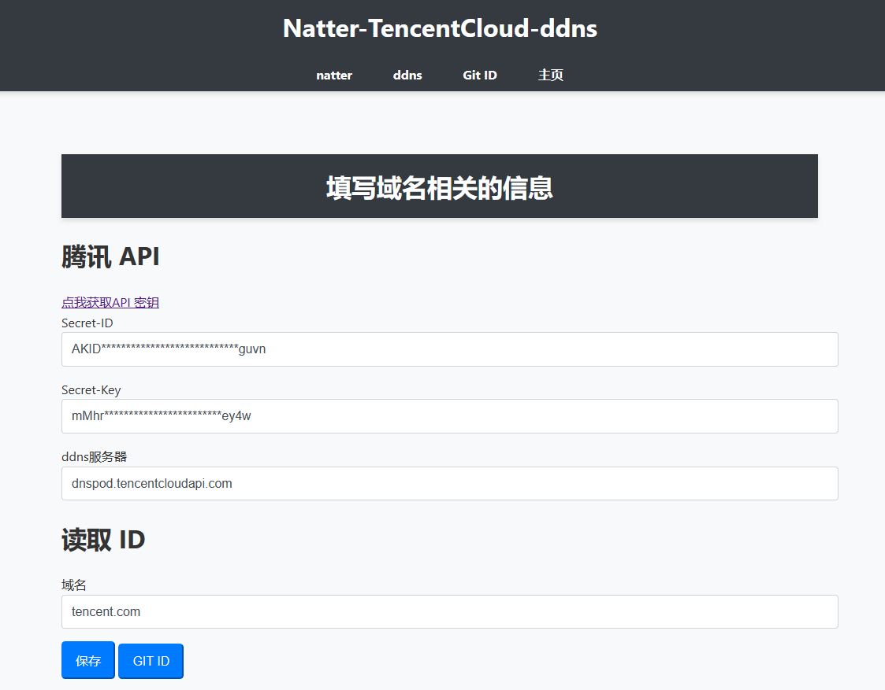
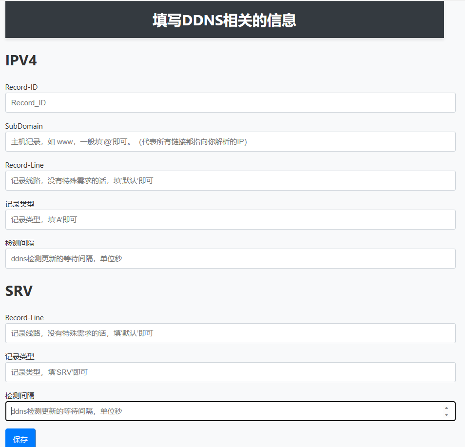
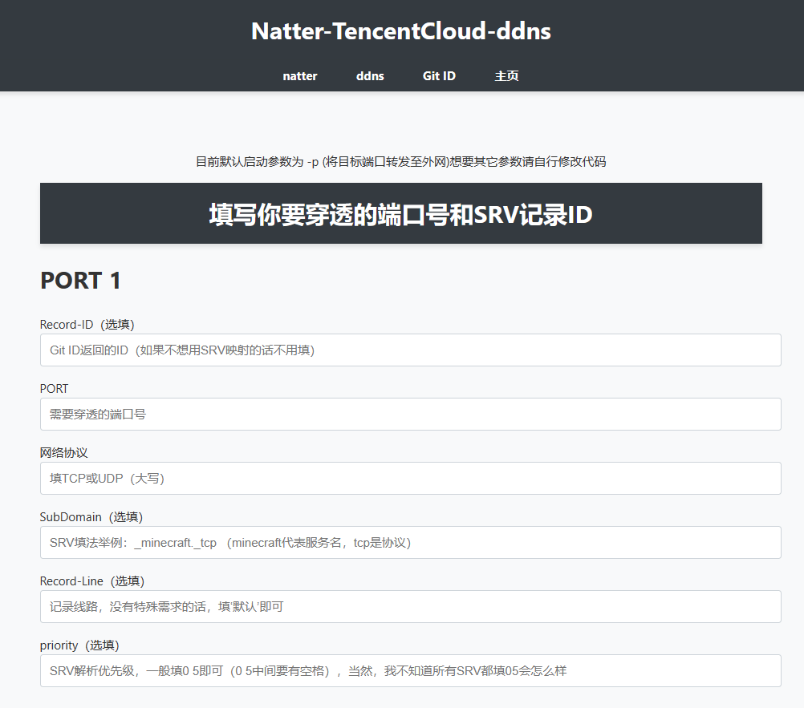
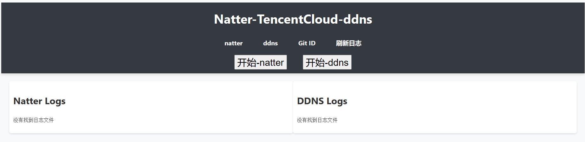

## Natter-TencentCloud-ddns
 
帮助 Natter 实现 SRV 端口及IP全自动DDNS  （支持多个端口同时SRV解析） 

可实现让支持SRV的软件，在不输入端口号的情况下就能直接访问对应的服务

理论上只要能运行Natter的设备都能用（具体自测试）

 - 此分支基于[Natter-v2](https://github.com/MikeWang000000/Natter)，支持TCP以及UDP（windows端暂不支持UDP，具体等natter主线修复）

 - Natter的具体功能及工作原理请自行前往[Natter-v2](https://github.com/MikeWang000000/Natter)查看
 - 这里只讲述如何使用[Natter-TencentCloud-ddns](https://github.com/shapaozidex/Natter-TencentCloud-ddns)

## 教程
2.0版本开始不再打包exe，只发python脚本
    下面开始教程

1.先把整个包下载下来  解压

2.打开[腾讯云 API 密钥](https://console.dnspod.cn/account/token/apikey)创建好api秘钥之后将它保存下来：

3.打开腾讯云解析界面，随便创建两个解析，一个SRV类型的，一个A类型的 （如果你需要同时映射及穿透多个端口号就多创建几个SRV类型的）
 目前最多支持5个SRV解析,因为支持SRV的软件太少了,所以就只写了5个
  这里直接照着我的一模一样的填就行了（防止不会弄而出错，反正后面都会被ddns自动改掉）
  
  _minecraft._tcp  |  SRV  |   默认  |  0 5 9999 tencent.com. 
  -----------------|-------|---------|-------------------------
  @                |   A   |   默认  |  99.99.99.99
             

4.运行web.py文件,你可以在执行的时候加一个参数作为启动端口号（设备要先安装python2.7及以上，还要安装两个 第三方库 ）
这三个库的安装命令分别是：

pip install --upgrade tencentcloud-sdk-python               
****
pip install flask
****
pip install flask-wtf

5.运行web.py之后,在本机浏览器输入127.0.0.1:9876(或者你自己输入的端口号)
默认只有127.0.0.1能访问到，想要让它能在公网或者局域网访问请自行编辑web.py文件(里面有说该怎么编辑)
打开之点击 Git ID 然后把刚刚保存的API秘钥填上
以及要ddns的域名(目前仅支持单个域名)

6.填完之后保存，然后点一次旁边的Git ID按钮(等它刷新完)
在点击Git ID之后,它会帮你把一些参数填好(你只需要填没有填好的那些就行了)

7点击上面的ddns按钮,按照框里的提示去填,然后点击保存

8.保存之后,点击上面的natter按钮,然后根据你需要的端口号去填(需要穿透多少个就填多少个)
填完之后,点击最下面的保存

9.全部弄完之后,点击右边的 主页 然后点击 开始natter 和 开始ddns
要等natter把端口号都打印完了再点ddns（手动刷新日志）
即可开始工作(记得检测域名解析有没有生效)

10.如果启动没反应，或者闪退报错啥的，那么大有可能是你 参数 填错了

## 额外补充

必须安装的几个模块(直接运行上面的pip命令即可安装)

****
flask    【用于创建 Web 应用程序的微框架】
****
flask_wtf    【Flask 的表单扩展，用于处理 Web 表单】
****
tencentcloud-sdk-python    【腾讯的sdk】

